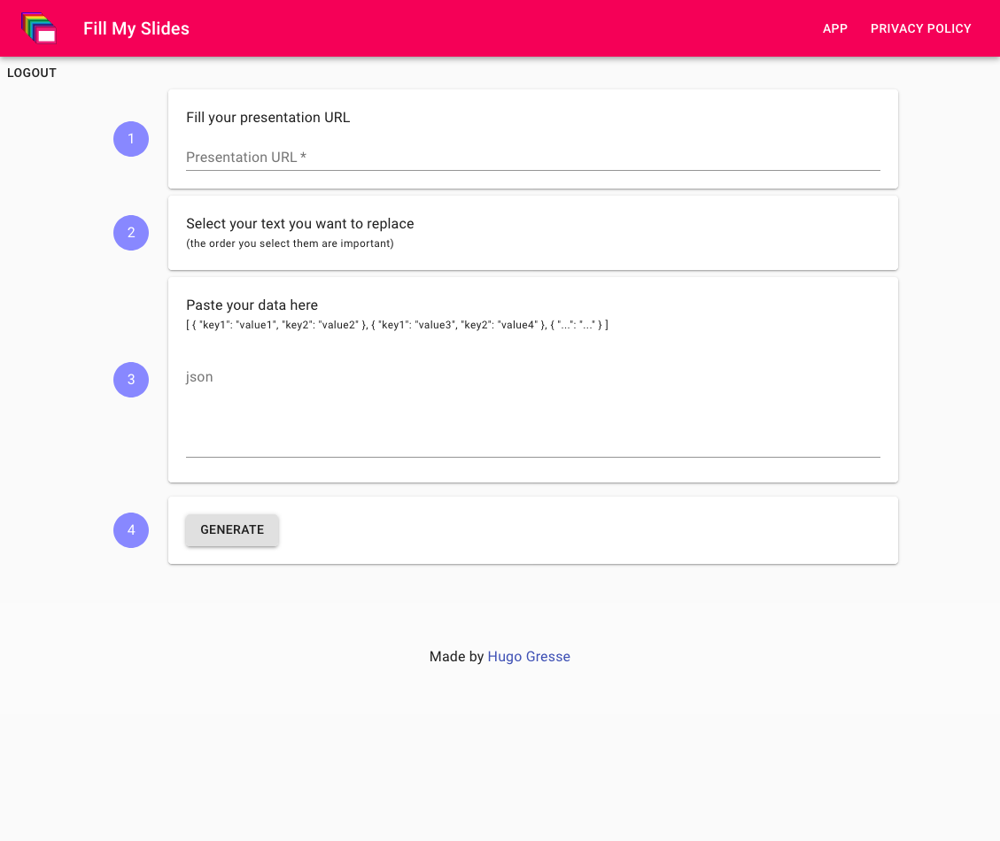

# Fill-My-Slides
React App that take a Google Presentation/Slides as a template to generate multiple images from

### > [fill-my-slides.web.app](https://fill-my-slides.web.app/)

# About
Open source project made by [Hugo Gresse](https://hugo.gresse.io)  
My other open source projects:
- [Open Feedback (speaker/conference/meetup event feedback SASS)](https://openfeedback.io/)
- [ICAL2API (.ical aggregation with admin, slack reminders, public page)](https://github.com/HugoGresse/Ical2Api)
